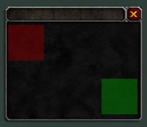

.. meta::
   :keywords: wotklui, texture, lua, xml, trinitycore, trinity, mangos, cmangos, azerothcore, script, scripting, doc, docs, documentation, ui, addons, wotlk

.. _xml_Texture:

Texture
=======

**<Texture>** (inherits from :ref:`<LayoutFrame><xml_LayoutFrame>`, creates a Texture widget) draws an image, solid color, or gradient.
Textures are layered UI elements, meaning they must be inside <Layer> tag.

.. code-block:: xml

    <Texture>
        <TexCoords />
        <Color />
        <Gradient />
    </Texture>

Attributes
----------
* **file** (string :abbr:`? (optional)`) - Resource file path to the texture image
* **alphaMode** (APLHAMODE :abbr:`? (optional)`) - Blending mode
* **alpha** (float :abbr:`? (optional)`) - Set opacity from 0 to 1 (default value)
* **nonBlocking** (boolean :abbr:`? (optional)`) - :abbr:`? (Needs summary)`
* **horizTile** (boolean :abbr:`? (optional)`) - If true, texture coordinates will be adjusted such that each texture pixel takes up one horizontal unit within the widget
* **vertTile** (boolean :abbr:`? (optional)`) - If true, texture coordinates will be adjusted such that each texture pixel takes up one vertical unit within the widget

Elements
--------
* :ref:`<TexCoords><xml_TexCoords>`
* **<Color>**
* **<Gradient>**

Summary
-------
The graphic may be an image loaded by Blizzard or an addon, or it may be a solid color or gradient. Textures support partially transparent images and different strategies for blending these into other images. They may be changed to show only a portion of a loaded image using texture coordinates. Note: The Texture must be within a <Layer>.

Examples
--------

.. code-block:: xml

    <Texture name="AuctionDressUpBackgroundBot">
        <Size x="171" y="83"/>
        <Anchors>
            <Anchor point="TOPLEFT" relativeTo="AuctionDressUpBackgroundTop" relativePoint="BOTTOMLEFT"/>
        </Anchors>
        <TexCoords left="0" right="0.61" top="0" bottom="0.588"/>
    </Texture>

.. code-block:: xml

    <Frame name="MyPanelFrame" parent="UIParent" inherits="UIPanelDialogTemplate">
        <Size x="200" y="170"/>
        <Anchors>
            <Anchor point="CENTER"/>
        </Anchors>
        <Layers>
            <Layer>
                <Texture>
                    <Size x="50" y="50"/>
                    <Color r="0.5" a="0.5"/>
                    <Anchors>
                        <Anchor point="TOPLEFT" x="10" y="-30"/>
                    </Anchors>
                </Texture>
                <Texture>
                    <Size x="50" y="50"/>
                    <Color g="0.5" a="0.5"/>
                    <Anchors>
                        <Anchor point="BOTTOMRIGHT" x="-10" y="15"/>
                    </Anchors>
                </Texture>
            </Layer>
        </Layers>
    </Frame>

Or using lua

.. code-block:: lua

    local frame = CreateFrame("Frame", "MyPanelFrame", UIParent, "UIPanelDialogTemplate")
    frame:SetSize(200, 170)
    frame:SetPoint("CENTER")

    local tex1 = frame:CreateTexture()
    tex1:SetSize(50, 50)
    tex1:SetPoint("TOPLEFT", 10, -30)
    tex1:SetTexture("Interface/Tooltips/UI-Tooltip-Background")
    tex1:SetVertexColor(0.5, 0, 0, 0.5)

    local tex2 = frame:CreateTexture()
    tex2:SetSize(50, 50)
    tex2:SetPoint("BOTTOMRIGHT", -10, 15)
    tex2:SetTexture("Interface/Tooltips/UI-Tooltip-Background")
    tex2:SetVertexColor(0, 1, 0, 0.5)

.. note::
    In XML you can just set the color. In lua you should set texture, and then change the color.

